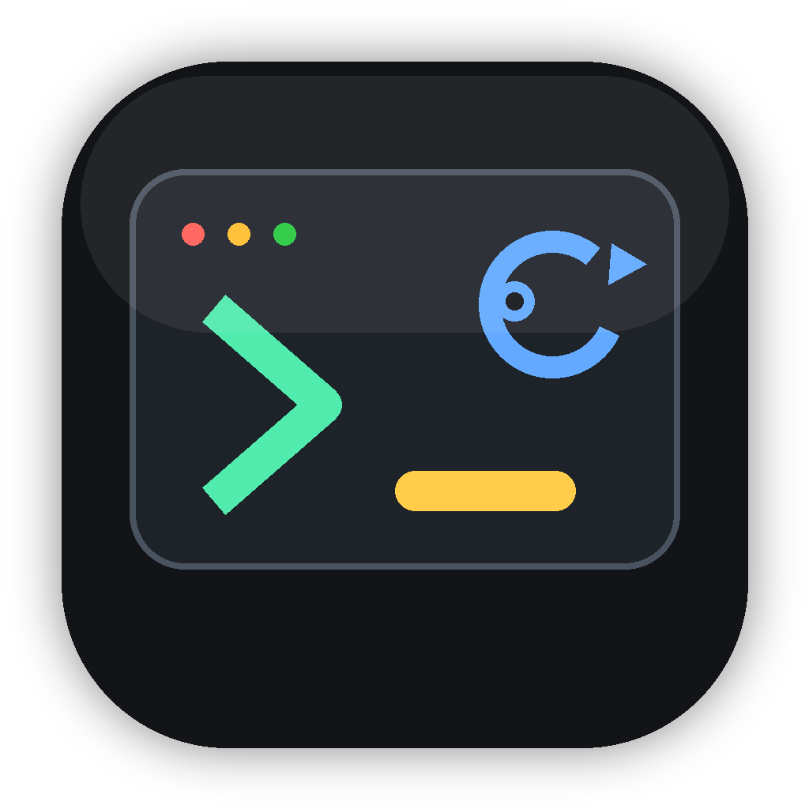

# CLI Ticker

CLI Ticker is a native macOS menu bar app for tracking command-line tools installed on a machine. It scans local package managers and executable paths, groups known AI agent CLIs, and shows available updates without requiring an account.



## Install

Once releases are published, users can install with:

```sh
mkdir -p "$HOME/Applications" && curl -L https://github.com/Malgsx/cli-ticker/releases/latest/download/CLITicker.app.tar.gz | tar -xz -C "$HOME/Applications" && open "$HOME/Applications/CLITicker.app"
```

This downloads the latest app bundle, installs it to `~/Applications`, and opens it. Users do not need to manually download or unpack anything.

If you prefer the installer script:

```sh
curl -fsSL https://raw.githubusercontent.com/Malgsx/cli-ticker/main/scripts/install.sh | bash
open "$HOME/Applications/CLITicker.app"
```

## What Users Get

- Icon-only menu bar app.
- `Agent Tools` submenu for tools like Codex, Claude, Amp, Cursor, Goose, OpenCode, CodeRabbit, Kisuke, Droid, and related CLIs.
- `Search CLIs` opens a native search panel for installed tools.
- `Updates Available` submenu with readable version changes and clickable update actions.
- Clickable agent tools that open the selected CLI in the user's preferred terminal.
- `Open Report` submenu for JSON or Markdown inventory reports.
- `Preferred Terminal` submenu with Terminal, Ghostty, iTerm, or Warp when installed.

## Local Scanning

CLI Ticker currently scans:

- Non-system executable directories in `PATH`.
- Homebrew formulas and casks.
- Homebrew outdated formulas and casks.
- Global npm packages and npm outdated status.
- Bun globals.
- uv tools.

Reports are written locally:

- `~/Library/Application Support/CLITicker/inventory.json`
- `~/Library/Application Support/CLITicker/inventory.md`

## Privacy

CLI Ticker stores inventory reports locally only. It shells out to installed local package managers to read versions and update availability. Homebrew auto-update and analytics are disabled for app-launched Homebrew commands.

No remote account, telemetry endpoint, or server sync is built into this version. Future API adapters should be opt-in and documented clearly.

## Run Locally

```sh
make run
```

The first refresh can take a while because Homebrew and npm update checks shell out to local package managers.

## Build The App

```sh
make
open build/CLITicker.app
```

The runnable app is `build/CLITicker.app`.

## Create A Shareable Zip

```sh
make dist
```

This creates:

```sh
build/dist/CLITicker.app.tar.gz
```

For public distribution, the next step is signing and notarization with an Apple Developer ID.

## Release A Version

```sh
git tag v0.1.0
git push origin v0.1.0
```

The GitHub Actions release workflow builds `CLITicker.app.tar.gz` and attaches it to the GitHub release. For a trusted public app, sign and notarize before promoting the release broadly.

## Forking

The app is intentionally small:

- `Sources/CLITickerObjC/main.m` contains the menu bar app and scanner.
- `Assets/Logos` contains bundled agent-tool logos.
- `scripts/generate_icon_assets.py` regenerates app/menu icons.
- `Makefile` builds and packages the app.

Forks can change known agent tools, package-manager scanners, branding, reports, and terminal launch behavior without adopting a larger framework.

## Distribution Checklist

- Replace `local.codex.cliticker` with the final bundle identifier.
- Sign the app with Developer ID Application.
- Notarize the app archive or DMG.
- Add a first-run explanation of what is scanned and where reports are saved.
- Add an explicit opt-in before adding remote announcement/update APIs.

## API Adapter Plan

The current code keeps source discovery isolated in `InventoryService`. Good next adapters:

- GitHub Releases
- npm registry metadata
- Homebrew livecheck
- vendor RSS feeds
- product-specific release endpoints

The app already stores `currentVersion`, `latestVersion`, `source`, `path`, and `status`, so remote feeds can merge into the same inventory model.
