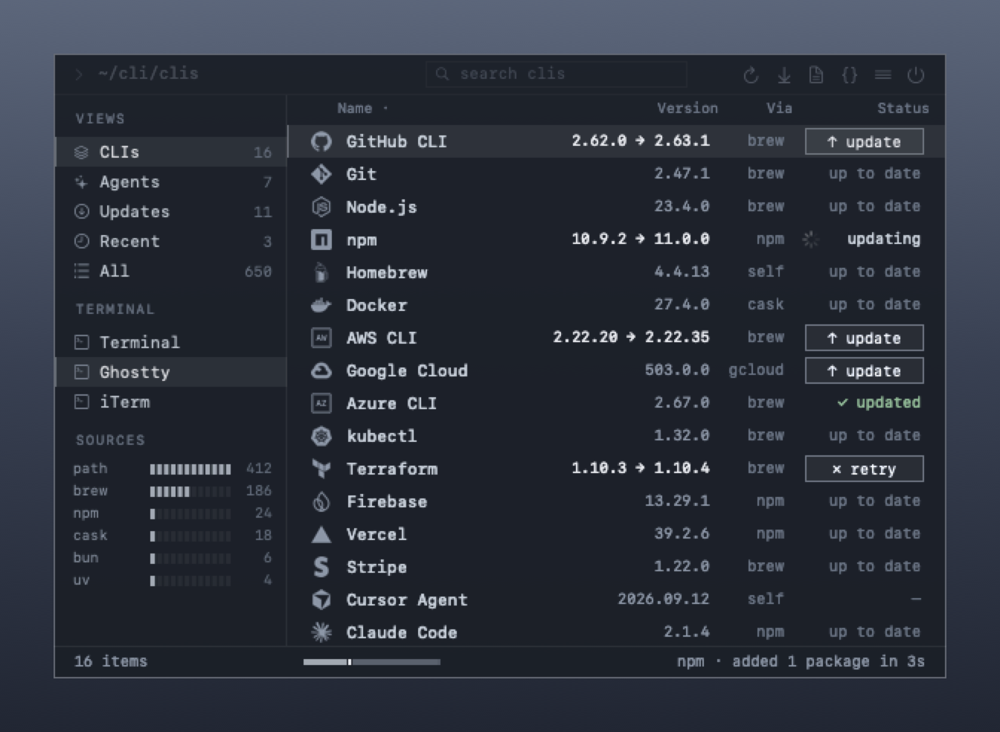

# CLI

**Install (macOS)** — paste into Terminal:

```sh
curl -fsSL https://raw.githubusercontent.com/Malgsx/cli-ticker/main/install.sh | bash
```

This downloads the latest release into `~/Applications`, clears the Gatekeeper quarantine flag, and opens the app. Look for the new icon in your menu bar. It also installs a `CLI` command. Run `CLI` to open the menu bar app.

## Update

After a new release is published, run this in Terminal:

```sh
CLI update
```

That replaces the app with the latest release and opens it again. `CLI` on its own opens the app you already have. `CLI reload` quits it and opens it again. `CLI version` prints the version and says when a newer release is out.

The menu bar app checks GitHub on launch and every six hours. When a release is newer than the installed app, it posts a notification and the panel footer says to run `CLI update`. A push becomes that update once it is published as a release.

## What it is

A native macOS menu bar app that finds every command-line tool on your Mac, groups your AI agent CLIs (Claude Code, Codex, Cursor Agent, Gemini, Aider, and others), and shows which ones have updates. You can update any of them with one click.

The first time it opens (the installer opens it for you), it scans your Mac and shows "Scanning your machine…" in the panel, then lists only what you actually have. It looks at `PATH`, Homebrew formulae and casks, npm and Bun globals, uv and pipx tools, `cargo install`, Go binaries, `~/.local/bin`, and CLIs bundled inside apps in `/Applications`. Tools it has no entry for still appear, with a generic icon. Later launches open instantly from the saved results and rescan in the background. Use the rescan button (⌘R) in the panel to scan again. The ☰ button (or right-clicking the menu bar icon) opens the menu: update all, rescan, select, the app version (click to update when a newer release exists), settings (terminal, rescan interval, launch at login, show or hide agents), the report, and About.

Click a row, or press Return, to open that CLI in your preferred terminal (Settings → preferred terminal). Agents such as Claude and Codex launch as-is. Other CLIs run with `--help`, unless their registry entry sets `open` to different arguments. The `↑ update` button on a row is a separate click and only updates.

**Select** in the toolbar or the menu (⌘S) puts a checkbox on each row. Click to toggle, shift-click a range, or press ⌘A to select everything that can be removed. The footer reads "N selected · Uninstall". Uninstall always opens a confirmation sheet that lists each CLI and the exact command (`brew uninstall`, `brew uninstall --cask`, `npm uninstall -g`, `pipx uninstall`, `uv tool uninstall`, `cargo uninstall`, removing a Go binary, `gh extension remove`, and the same idea for Bun). Nothing is removed until you confirm. Apple’s own tools and CLIs bundled inside apps stay unchecked, with a reason. Confirmed uninstalls run one at a time, show a result on each row, then rescan.

**Privacy:** nothing about your machine is hardcoded in the app or uploaded anywhere. The scan results are saved only in `~/Library/Application Support/CLITicker`. There is no account and no telemetry. The only network traffic is version lookups: the package managers' own `outdated` commands, and anonymous requests to the public GitHub releases API for tools whose latest version is published there, and for CLI itself.



## Build from source / fork

Needs the Xcode Command Line Tools (`xcode-select --install`). Run this in any folder:

```sh
git clone https://github.com/Malgsx/cli-ticker.git && cd cli-ticker && ./cli run
```

To make it your own, click **Fork** at the top of this page, then clone your fork the same way, replacing `Malgsx` with your GitHub username. `./cli run` builds `build/CLITicker.app` and opens it. Every project command goes through `./cli`:

```sh
./cli help       # list all commands
./cli build      # build build/CLITicker.app
./cli run        # build, then open the app
./cli test       # run the unit tests
./cli install    # build and install to ~/Applications, then launch it
./cli update     # install the latest published release and relaunch
./cli uninstall  # quit and remove the installed app and its saved data
./cli version    # print the version (from the VERSION file)
```

See [docs/customizing.md](docs/customizing.md) to add CLIs, change logos, rename the app, sign it, and publish your own releases.

## Uninstall

From a clone, run `./cli uninstall`. Without a clone, paste this into Terminal:

```sh
pkill -x CLITicker
rm -rf ~/Applications/CLITicker.app ~/Library/Application\ Support/CLITicker
if grep -q cli-ticker-command ~/.local/bin/CLI 2>/dev/null; then rm -f ~/.local/bin/CLI; fi
```

## For AI agents

To install CLI on the user's Mac, run these steps in order. Stop and report the error output if any step fails.

1. Check that you are on macOS. This command must print `Darwin`:

   ```sh
   uname -s
   ```

2. Install. The command quits any running copy, installs to `~/Applications/CLITicker.app`, and launches it:

   ```sh
   curl -fsSL https://raw.githubusercontent.com/Malgsx/cli-ticker/main/install.sh | bash
   ```

   On success, the output ends with `Installed CLI <version> to /Users/<user>/Applications/CLITicker.app` and `CLI is running.`

3. Verify. This command must print `ok` and a process ID:

   ```sh
   test -x ~/Applications/CLITicker.app/Contents/MacOS/CLITicker && pgrep -x CLITicker && echo ok
   ```

Tell the user to look for the CLI icon in the menu bar and click it. To install without launching the app, set `CLI_TICKER_NO_LAUNCH=1` for the `bash` side of the pipe (`... | CLI_TICKER_NO_LAUNCH=1 bash`). To build from source instead, run the clone command in [Build from source / fork](#build-from-source--fork) from the user's current directory. It needs `xcode-select -p` to succeed first. Inside the clone, use `./cli <command>` for everything (`./cli help` lists them): `./cli install` puts the source build in `~/Applications` and launches it, `./cli test` runs the tests, and `./cli uninstall` removes the app and its data.

## More

- [Customizing, packaging, and how scanning works](docs/customizing.md)
- [Contributing](CONTRIBUTING.md) · [Security](SECURITY.md) · [MIT License](LICENSE)
