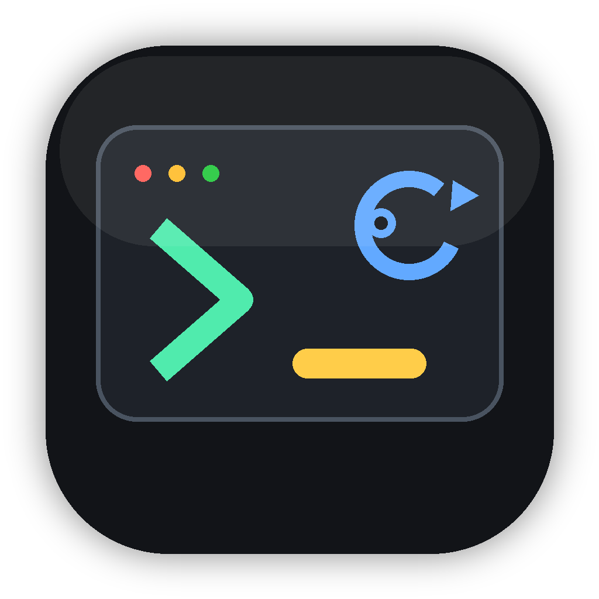

# CLI

CLI is a native macOS menu bar app for tracking command-line tools installed on a machine. It scans local package managers and executable paths, groups known AI agent CLIs, and shows available updates without requiring an account.



## Install

Once releases are published, users can install with:

```sh
mkdir -p "$HOME/Applications" && curl -L https://github.com/Malgsx/cli-ticker/releases/latest/download/CLITicker.app.tar.gz | tar -xz -C "$HOME/Applications" && open "$HOME/Applications/CLITicker.app"
```

This downloads the latest app bundle, installs it to `~/Applications`, and opens it. Users do not need to manually download or unpack anything.

If you prefer the installer script:

```sh
curl -fsSL https://raw.githubusercontent.com/Malgsx/cli-ticker/main/scripts/install.sh | bash
open "$HOME/Applications/CLITicker.app"
```

## What Users Get

- Icon-only menu bar app. Clicking the icon opens a compact, keyboard-friendly panel (dark slate, monospace, Omarchy-style) with `CLIs`, `Agents`, `Updates`, `Recent`, and `All` views, inline search, a preferred-terminal picker, and per-source bar charts. Right-click (or control-click) the icon for the classic menu below.
- `CLIs` view: well-known CLIs (gh, git, node, npm, brew, docker, kubectl, terraform, aws, gcloud, az, firebase, vercel, stripe, cursor, claude, and more) with a monochrome logo, installed version, how it was installed, and whether it is up to date. When an update is available the row's `↑ update` button runs the matching command in the background (for example `brew upgrade gh`, `npm install -g firebase-tools`, `gcloud components update --quiet`, `gh extension upgrade --all`), shows live progress and the result, then re-checks the version. Updates only ever run from that click.
- `Agent Tools` submenu for tools like Codex, Notion, Antigravity, Claude, Amp, Cora, Cursor, Goose, OpenCode, CodeRabbit, Kisuke, Droid, and related CLIs.
- `Search CLIs` opens a native search panel for installed tools.
- `Updates Available` submenu with readable version changes, clickable update actions, and an `Update All` action that runs every supported update in one terminal session. Updated tools are removed from the list automatically after the rescan that follows.
- `Recently Updated` submenu that fills in automatically when a CLI is installed or updated on the machine.
- Clickable agent tools that open the selected CLI in the user's preferred terminal.
- `Open Report` submenu for JSON or Markdown inventory reports.
- `Preferred Terminal` submenu with Terminal, Ghostty, iTerm, or Warp when installed.

## CLI Update Checks

Checks run in the background and are cached, so opening the panel is instant:

- Installed versions are cached per binary (path + modification time) in `~/Library/Application Support/CLITicker/cli-versions.json`, so a version probe reruns only when a binary changes.
- Homebrew and npm installs use the inventory scan (`brew outdated`, `npm outdated -g`).
- Self-updating tools use a registry `check` command (for example `gcloud components list`) or the latest GitHub release, cached for 6 hours in `github-releases.json`.
- System binaries (such as `/usr/bin/git`) are shown as `system` and are never updated.

## Local Scanning

CLI currently scans:

- Non-system executable directories in `PATH`.
- Homebrew formulas and casks.
- Homebrew outdated formulas and casks.
- Global npm packages and npm outdated status.
- Bun globals.
- uv tools.

Reports are written locally:

- `~/Library/Application Support/CLITicker/inventory.json`
- `~/Library/Application Support/CLITicker/inventory.md`
- `~/Library/Application Support/CLITicker/changes.json` (recent install/update events)

## Automatic Change Detection

CLI watches common install locations (Homebrew `bin`/`Cellar`/`Caskroom`, `~/.local/bin`, `~/.bun/bin`, `~/.npm-global/bin`, and similar) with FSEvents. When a CLI is downloaded or updated on the machine — whether through the app, a package manager, or a `curl | bash` installer — the watcher triggers a debounced rescan a few seconds later. The rescan:

- moves the tool out of `Updates Available` once it is current, and
- records the change in the `Recently Updated` bucket, showing the version transition (for example `0.1.0 → 0.2.0`) and how long ago it happened.

Recently Updated entries expire after 24 hours and are also written to the Markdown report. The 15-minute background scan and post-update marker refresh still run as a fallback.

## Privacy

CLI stores inventory reports locally only. It shells out to installed local package managers to read versions and update availability. Homebrew auto-update and analytics are disabled for app-launched Homebrew commands.

No remote account, telemetry endpoint, or server sync is built into this version. Future API adapters should be opt-in and documented clearly.

## Run Locally

```sh
./cli run
```

The first refresh can take a while because Homebrew and npm update checks shell out to local package managers.

## Build The App

```sh
./cli build
open build/CLITicker.app
```

The runnable app is `build/CLITicker.app`.

## Create A Shareable Archive

```sh
./cli dist
```

This creates:

```sh
build/dist/CLITicker.app.tar.gz
```

For public distribution, the next step is signing and notarization with an Apple Developer ID.

## Release A Version

```sh
git tag v0.1.0
git push origin v0.1.0
```

The GitHub Actions release workflow builds `CLITicker.app.tar.gz` and attaches it to the GitHub release. For a trusted public app, sign and notarize before promoting the release broadly.

## Forking

The app is intentionally small:

- `Sources/CLITickerObjC/main.m` contains the menu bar app and scanner.
- `Sources/CLITickerObjC/TickerPanel.m` renders the menu bar panel.
- `Sources/CLITickerObjC/CLIRegistry.m` detects registry CLIs, checks for updates, and runs updates with streamed progress.
- `Assets/CLIRegistry/registry.json` is the data-driven list of known CLIs: binaries, version parsing, Homebrew/npm package names, self-update commands, update checks, and GitHub release repos. Add an entry to support a new CLI.
- `Assets/CLIRegistry/icons` holds monochrome template icons from [Simple Icons](https://simpleicons.org) (CC0; brand marks remain their owners' trademarks). `scripts/fetch_cli_icons.py` regenerates them. Brands that Simple Icons no longer carries use a monogram.
- `make previews` renders the panel with fixture data to `build/previews/*.png`; CI uploads them as the `panel-previews` artifact.
- `Assets/Logos` contains bundled agent-tool logos.
- `scripts/generate_icon_assets.py` regenerates app/menu icons.
- `Makefile` builds and packages the app.

Forks can change known agent tools, package-manager scanners, branding, reports, and terminal launch behavior without adopting a larger framework.

## Distribution Checklist

- Replace `local.codex.cliticker` with the final bundle identifier.
- Sign the app with Developer ID Application.
- Notarize the app archive or DMG.
- Add a first-run explanation of what is scanned and where reports are saved.
- Add an explicit opt-in before adding remote announcement/update APIs.

## API Adapter Plan

The current code keeps source discovery isolated in `InventoryService`. Good next adapters:

- GitHub Releases
- npm registry metadata
- Homebrew livecheck
- vendor RSS feeds
- product-specific release endpoints

The app already stores `currentVersion`, `latestVersion`, `source`, `path`, and `status`, so remote feeds can merge into the same inventory model.
